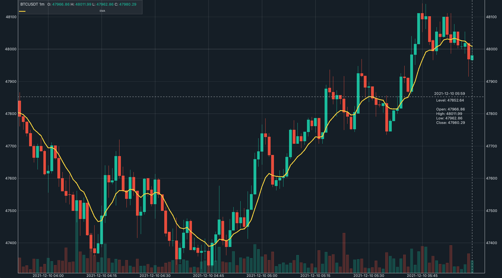
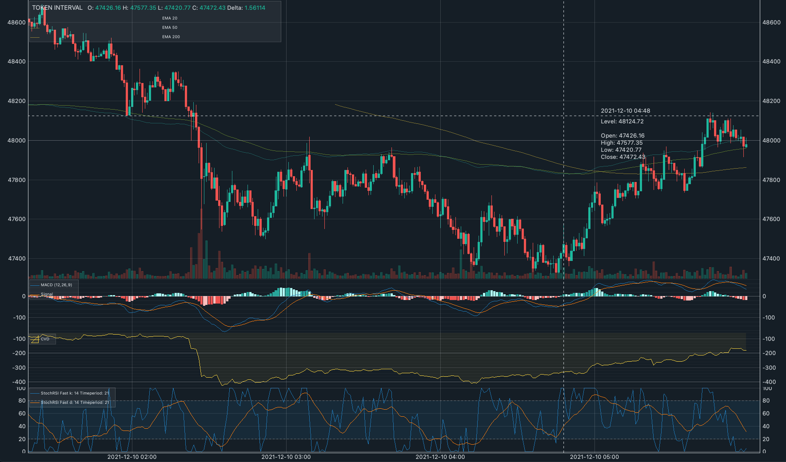
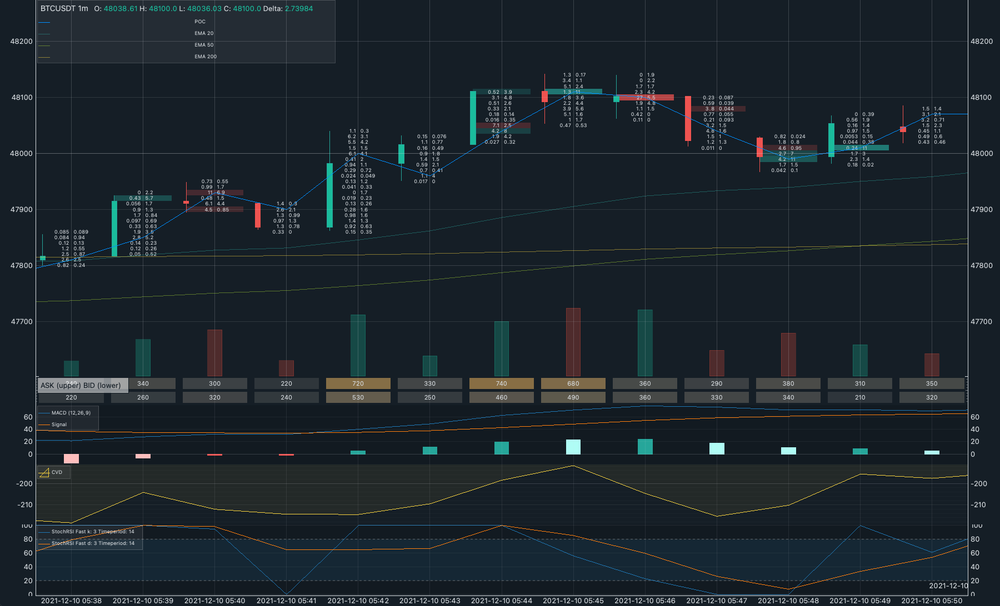

# stack-orderflow

> This repo is still undergoing heavy development.

Orderflow chart GUI using [Finplot](https://github.com/highfestiva/finplot) and [PyQtGraph](https://github.com/pyqtgraph/pyqtgraph).

## Plotting

The plotting is largely based on the [original Finplot library](https://github.com/highfestiva/finplot), with slight modification in order to allow for orderflow plotting. The original finplot library package is included in this repo in `finplotter/finplot_library`. This repo modifies the original package in a pretty hacky way, so please use with caution. It is advised to look into the package itself for further customization.

## How to use
The codes in this repo toy examples of utilising the [original Finplot library](https://github.com/highfestiva/finplot) for visualizing orderflow candlestick data. You may want to start off by going through the examples in `examples/` directory.

## Demo from `examples`

### Example 01: Simple candlestick plot

### Example 02: Simple candlestick plot with technical indicator panels

### Example 03: Orderflow plot with static data

## To-do
### Example 04: Orderflow plot with real time data streaming
<!--  -->